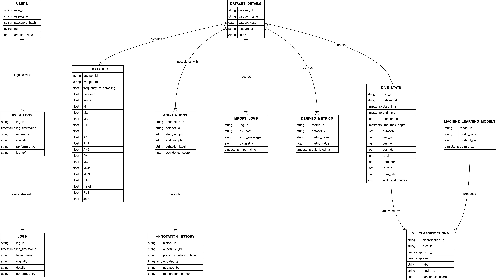
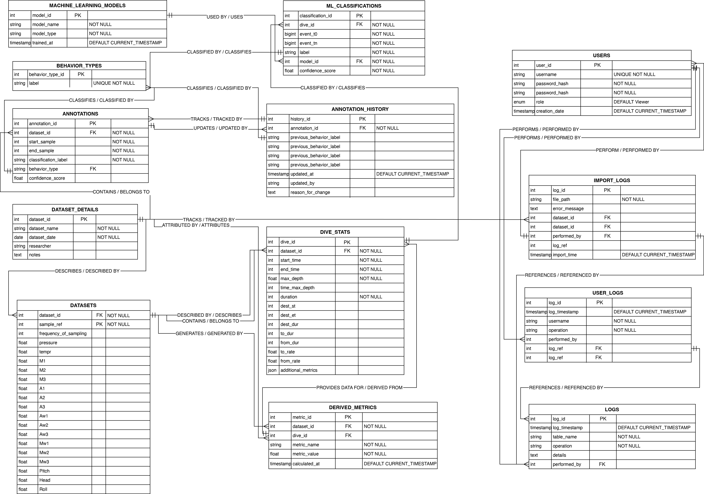

# WDAS SQL Database Project

## Overview
The WDAS (Whale Dive Annotation System) project is a fully normalized relational database designed to support scientific computing workflows in behavioral ecology. It was built to manage biologging datasets, annotations, and behavior classifications at scale. The database enables high-throughput data ingestion, processing, and traceability for iterative research workflows.

Developed in collaboration with researchers at Syracuse University, this system simulates real-world ecological data management scenarios — specifically focusing on humpback whale behavior — and showcases schema design, query optimization, and UI prototyping.

## Tools & Technologies
- SQL (PostgreSQL / SQLite)
- Entity Relationship Modeling (ERD)
- Jupyter Notebook (Google Colab compatible)
- Python (for automation and querying)
- HTML/CSS (UI concepts)
- Lucidchart / dbdiagram.io (for schema design)

---

## Features
- Normalized schema up to 3NF
- Conceptual and logical ERD models
- SQL DDL scripts for schema creation
- Advanced SQL queries (joins, subqueries, aggregates)
- Annotation tracking with version history
- User logs and import traceability
- Sample data visualization walkthrough in notebook
- UI prototypes for dataset import and summary view

---

## Entity-Relationship Diagrams

- 
- 

These diagrams illustrate how entities such as `DATASET_DETAILS`, `ANNOTATIONS`, `DIVE_STATS`, and `ML_CLASSIFICATIONS` interact within the schema. The design emphasizes traceability, flexibility, and scalability.

---

## How to Run

Use the following walkthrough notebook to set up and explore the database:

- [`WDAS_Walkthrough.ipynb`](notebooks/WDAS_Walkthrough.ipynb)

### Workflow Steps:
1. **Database Creation**  
   Run Step 1 in the notebook to initialize the database schema.
2. **Data Ingestion**  
   Insert sample datasets and annotations.
3. **Querying & Visualization**  
   Run the included SQL queries to extract insights and view summaries.

---

## Example SQL Query

```sql
-- Retrieve all dives with an average depth greater than 30m
SELECT d.dataset_id, AVG(d.depth) AS avg_depth
FROM dive_stats d
GROUP BY d.dataset_id
HAVING AVG(d.depth) > 30;


/wdas-sql-database
├── schema/                # SQL scripts for schema and table creation
│   └── ddl_wdas_schema.sql
├── notebooks/             # Workflow demonstration notebook
│   └── WDAS_Walkthrough.ipynb
├── diagrams/              # ERD visualizations (conceptual/logical)
│   ├── dataModel_Conceptual.jpeg
│   └── dataModel_Logical.jpeg
├── docs/                  # Technical whitepaper and supplemental material
│   └── Whitepaper.pdf
├── ui-prototypes/         # HTML-based UI mockups for import and summary views
│   ├── form_importManagerUI.html
│   └── form_datasetSummaryViewUI.html
└── README.md              # This documentation file

